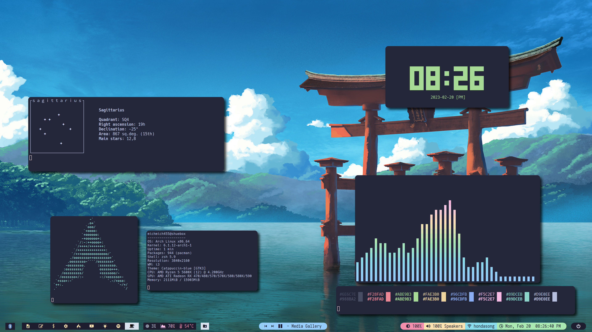

# dotfiles

My dotfiles for the following programs:
- dunst
- alacritty
- nvim
- picom
- polybar
- ranger
- scripts
- zathura
- zsh
- rifle
- i3
- rofi
- albert
- git
- thunar
- X-settings
- GTK
- flameshot
- cli-visualizer
- pistol
- spicetify

